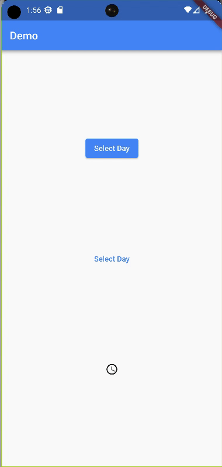

<!--
This README describes the package. If you publish this package to pub.dev,
this README's contents appear on the landing page for your package.

For information about how to write a good package README, see the guide for
[writing package pages](https://dart.dev/guides/libraries/writing-package-pages).

For general information about developing packages, see the Dart guide for
[creating packages](https://dart.dev/guides/libraries/create-library-packages)
and the Flutter guide for
[developing packages and plugins](https://flutter.dev/developing-packages).
-->

# Date Time Picker

The date time picker to be able to input a date.

## Features

### Drag down date time picker

A picker that is placed in the top of the screen.
You are able to select a day at this point.
When it is dragged down you are able to select a day for a given month.

### Overlay date time picker

A picker, that when opened using a button, is placed over the screen.
Then you are able to swipe through the month to select a day.
It is possible to add a constraint to de picker to limit the choice of day.



## Getting started

TODO: List prerequisites and provide or point to information on how to
start using the package.

## Usage

```dart
OverlayDateTimePicker(
    alignment: Alignment.bottomCenter,
    child: const Text("Select Day"),
    onTapDay: (date) {},
),
```

See the [Example Code](example/lib/main.dart) for more example's on how to use this package.

## Issues

Please file any issues, bugs or feature request as an issue on our [GitHub](https://github.com/Iconica-Development/flutter_date_time_picker/pulls) page. Commercial support is available if you need help with integration with your app or services. You can contact us at [support@iconica.nl](mailto:support@iconica.nl).

## Want to contribute

If you would like to contribute to the plugin (e.g. by improving the documentation, solving a bug or adding a cool new feature), please carefully review our [contribution guide](../CONTRIBUTING.md) and send us your [pull request](https://github.com/Iconica-Development/flutter_date_time_picker/pulls).

## Author

This `flutter-date-time-picker` for Flutter is developed by [Iconica](https://iconica.nl). You can contact us at <support@iconica.nl>
